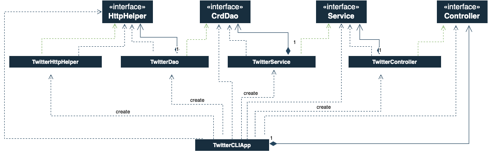

# Introduction
The Twitter application is developed using Java to allow users to post, delete and show tweets. The application uses Apache Http libraries and 1.0 OAuth libraries to interact with Twitter APIs and Jackson library to parse objects to JSON and vice versa. MVC architecture was implemented to handle specific development aspects of an application. Maven was implemented to manage project dependencies and the application was deployed using Docker. Other technologies used were Spring, Springboot and Postman.
# Quick Start
### Package the project using Maven
Export the environment variables consumerKey, consumerSecret, accessToken and tokenSecret.
Then compile the project using maven
```bash
mvn clean compile package

# We can run the project using java jar
java -jar java_apps-1.0-SNAPSHOT.jar post|show|delete [options]
```
### Run App with Docker
Pull the packaged project from docker hub.
```bash
docker pull oreoluwalawal/twitter
```
Then run the application
```bash
# Post a tweet
docker run ${user}/twitter post "tweet text"

# Show a tweet with only id option
docker run ${user}/twitter show "id"

# Show a tweet with id and fields options
docker run ${user}/twitter show "id" "field1,field2"

# Delete a tweet
docker run ${user}/twitter delete "id"

```
# Design
## UML Diagram


MVC architecture was implemented and consists of several components such as app/main, controller, service, DAO.
#### TwitterCLIApp
The class layer accepts the command line arguments and calls all the dependency classes. 
This layer passes the argument to the required HttpHelper and parses the returned object to JSON and outputs it to the console.

#### Controller
The TwitterController class validates the arguments such as the requests type and the number of arguments, then parses them for the service layer. The object returned is then passed to the application layer. 

#### Service
The TwitterService class layer validates the argument options (tweet, tweet-id and fields), then the layer passes the options to the DAO and returns the result to the service layer.

#### DAO
The TwitterDao class utilizes the TwitterHttpHelper class to execute post, delete and get requests. This layer contains the API URLs and passes them and the user arg options into their respective requests, the HTTP response is then verified with a status code and if the response is valid the JSON result is then parsed to an object and returned to the service layer.
## Models
Several models were created to reflect the JSON responses for the post, delete and get tweet requests.

#### Post
The CreateTweet model represents the JSON object returned after a tweet is successfully posted, it consists of edit_history_tweet_ids, id and text.

#### Show 
The Tweet model represents all the required values returned, it uses several classes to express the JSON objects;
- Entities
- Hashtag
- UserMention
- Coordinates
#### Delete
The DeleteTweet model represents the JSON object returned after a delete request is executed, it consists of a boolean value that shows if the tweet was successfully deleted or not.

## Spring
In TwitterCLIApp, we used the main method to create all components and set up the dependency relationship manually.
Doing this can become much of a task to manage when multiple controllers, services, or DAOs are implemented.
Spring framework helps to manage all dependencies and replaces the main method in the TwitterCLIApp. Several approaches was used;


#### Bean approach
The dependency relationship was defined using `@Bean` and passed dependencies through method arguments, 
then IoC container/context automatically instantiates all Beans base on the relationship specified.

#### ComponentScan
The TwitterCLIComponentScan uses @Autowired annotation to tell the IoC container to inject dependency through the constructor.
We also specify @Component to let the IoC container where to find the Bean.

#### SpringBoot
The TwitterCLISpringBoot uses the annotation @SpringBootApplication  which is a composition of multiple annotations and helps to configure Spring automatically.

# Test
Integration and unit tests were done on the project. JUnit 4 was implemented for integration testing and Mockito was implemented for unit testing.

Integration tests were done to test the classes and their dependencies, it uses @Test annotation to control test class workflow like methods and
for each @Test case/method, assertions are used to test the expected result and actual result. Unit tests were used to test the classes but not their dependencies,
dummy objects are implemented to mock and have control of what object is returned.

# Deployment
Docker was used to containerize the app and pushed to docker hub. I created a Dockerfile to define my Twitter app image, export the environment variables and provided the execution pathway with Entrypoint.
#### Dockerfile
```bash
FROM openjdk:8-alpine
COPY target/java_apps*.jar /usr/local/app/twitter/lib/twitter.jar
ARG consumerKey
ARG consumerSecret
ARG accessToken
ARG tokenSecret
ENV consumerKey $consumerKey
ENV consumerSecret $consumerSecret
ENV accessToken $accessToken
ENV tokenSecret $tokenSecret
ENTRYPOINT ["java","-jar","/usr/local/app/twitter/lib/twitter.jar"]
```
Build and push the application to docker hub
```bash
# build the docker container
docker build -t ${user}/twitter --build-arg consumerKey=$consumerKey --build-arg consumerSecret=$consumerSecret --build-arg accessToken=$accessToken --build-arg tokenSecret=$tokenSecret .

# run
docker run --rm -v `pwd`/data:/data -v `pwd`/log:/log ${user}/twitter post|show|delete [options]

# push to docker hub
docker push ${user}/twitter


```

# Improvements
- We can create a database to keep a record of the users' tweets, so they can manage it accordingly, it will be easier to delete and show tweets.
- Implement functionality to permit a user to schedule when they want to post a tweet, even have a queue and state the timeline of when it will be uploaded.
- GUI can be implemented to make the application user-friendly. 